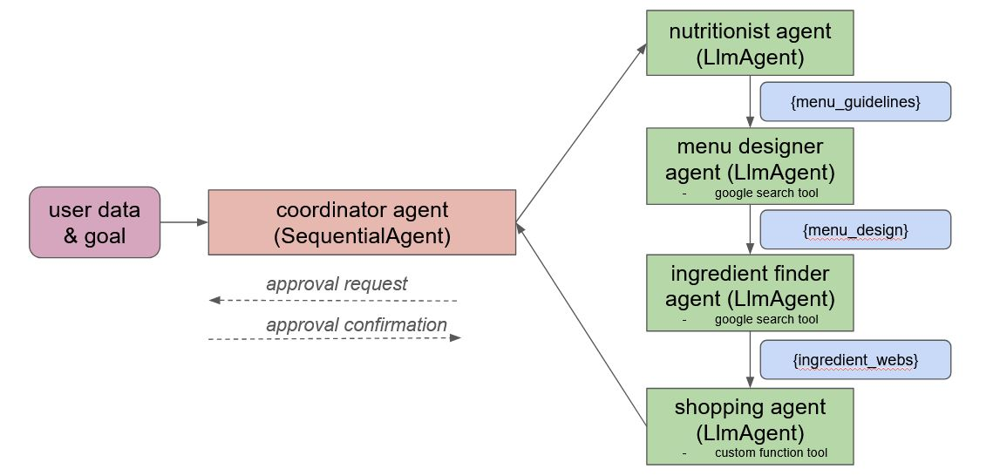

# Meal designer and shopper (capstone project for google agents course)

Dec 2025

## Overview

This project showcases the use of an agentic architecture (via the google ADK). The code implements an intelligent 
meal designer and ingredient shopper, in order to ease the user from these tasks.

The app uses a sequential agent architecture, where a coordinator agent sequentially invokes a set of four sub-agents 
with dedicated tasks. Namely:

- **Nutritionist agent**: this LLM agent acts as a professional nutritionist in charge of designing a balanced menu for 
the user. It takes as input some user data (gender, age, weight, height... and whatever the user considers necessary 
for the task) an initial user goal (e.g. 'I want to loose weight'). The agent task is to design a menu  
taking into account the user data and preferences. Output is provided to the next agent via the {menu_guidelines} key.
- **Menu designer agent**: this LLM agent takes as input the menu guidelines produced by the previous agent and creates a 
full menu for an entire week (seven days, three meals each day). The menu can include links to recipes the user can 
refer to. This agent can use the built-in 'google_search' tool for finding necessary data. The output is stored in 
the {menu_design} key.
- **Ingredient finder agent**: this LLM agent receives the week menu produced by the menu designer and finds online stores 
where the ingredients for the menu can be acquired. It will scan the web using the 'google_search' tool to produce a 
list of ingredients, URLs, quantities and prices. The agent is strictly instructed on the output format, as this 
result will be later parsed by a custom function. An example of this agent's output is as follows:

>rolled oats,https://www.amazon.es/dp/B09242N53J,1.5 kilograms,6.78
> 
>whey protein isolate,https://www.amazon.es/dp/B01N0X735B,1 kilograms,34.99
> 
>mixed berries,https://www.amazon.es/dp/B08V41J48P,500 grams,4.59
> 
>chia seeds,https://www.amazon.es/dp/B00LPN9Q4O,250 grams,4.15

- **Shopping agent**: this is the last agent in the sequence. It takes as input the list of ingredients and URLs produced 
by the previous agent and uses a custom function tool ('place_ingredients_order') to create the order. If the total 
amount to pay for this order exceeds a threshold, human intervention is requested and prompted via console. The user 
will have to either accept or deny the order, and this decision will be passed again to the custom function.

The following diagram depicts the agent architecture:

The whole sequence ends with either the shopping order approved or denied. This is meant as a proof of concept, and 
therefore no real order is placed.

The coordinator uses sessions in order to be able to add human intervention for the last step. The code implements an 
in-memory session service, as the code does not pretend to store any data beyond a simple example. Memory management 
will be added in the future to allow the system to remember user preferences and adapt according to the user evolution.

## Features included

- **Sequential agents**: 4 LLM agents are defined and used sequentially by a coordinator agent
- **Built-in tools (google search)**
- **Long-running operations (pause/resume agents)**: a custom operation featuring human approval request is used in the last agent
- **Sessions**: an in-memory session service is defined to maintain the session in the process 
- **Logging & tracing**: the LoggingPlugin is enabled on the App to have further insight on the agents processing flow

## Project structure

The project only includes two files:

- **main.py**: the entry point for the application. ADK app and runner are defined and executed here. It also includes
some helper functions for printing agents responses and detecting human intervention requests.
- **agents.py**: definition of the agents used in the app, as well as custom tools.

## Testing

Before testing, run the following command to install google-adk
>pip install google-adk

The code uses the Gemini API, which uses an API Key. In order to run de app, create a file named "GOOGLE_API_KEY" in
the root dir and paste the API Key in it. The code will fail to run if this file is not present.

To run the app, simply execute main.py. This file includes the initial user request in the variable QUERY ("I am a 47 year old male, 1,85 meters tall and weigh 72 kg. I want to gain muscle without gaining any fat."). 
You can overwrite this query with whatever other query you wish to make to the system to test it.

All agents use the 'gemini-2.5-flash-lite' model, which is good enough for testing. You can overwrite this in the code 
and replace it with other available models.

Execution can take around one minute.

The file 'sample_output.txt' contains the full output of one run.